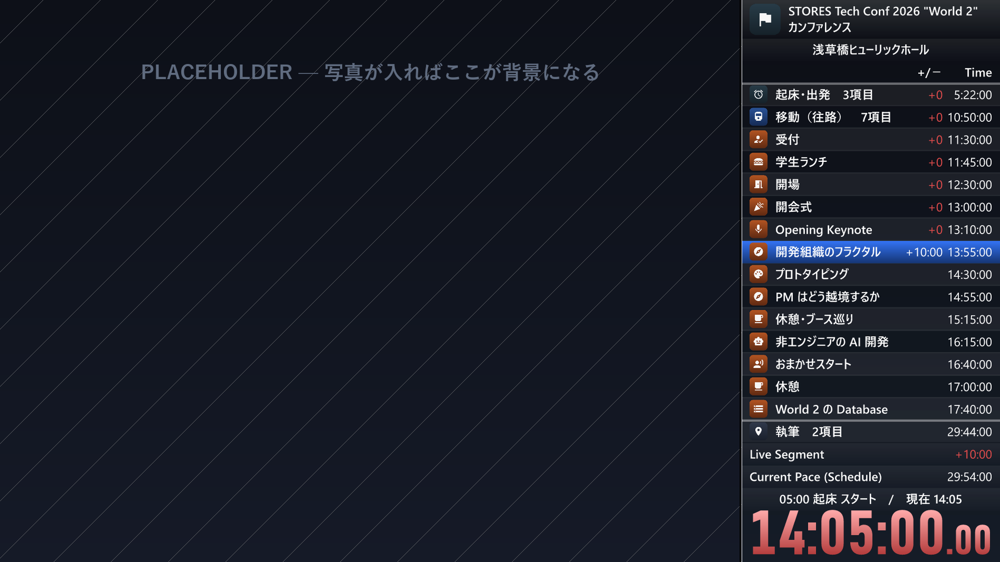
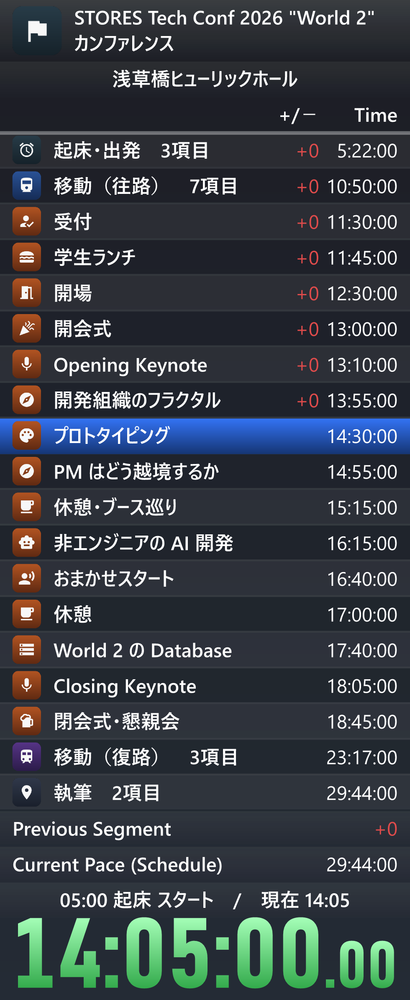

# rta-day

Turn a day's itinerary and the photos you took into speedrun-style images, with a
**real LiveSplit timer** on the side.

The timer is not a lookalike. A small Rust binary links
[livesplit-core](https://github.com/LiveSplit/livesplit-core) and renders the actual
components — split list, deltas, gold/green/red colouring, Previous Segment,
Current Pace — from a JSON spec. Python reads your photos' EXIF, matches them to the
itinerary, and composites the panel next to each photo.



Made with it: **[AI時代の開発を見に行く: STORES Tech Conf 2026 "World 2" 体験記](https://zenn.dev/nemut_ai/articles/stores-tech-conf-2026-world2)** —
a day trip rendered as a run. The itinerary and the pinned times behind that article are
in [`examples/stores-tech-conf-2026/`](examples/stores-tech-conf-2026/).

```
schedule.json ─┐
               ├─→ rta_day.py ──→ spec.json ──→ lsrender (Rust + livesplit-core) ──→ panel PNG
photo EXIF ────┘                                                                      │
                                              composite over the photo ←──────────────┘
```

## Install

Needs Python 3.10+ and a Rust toolchain. Build the renderer once:

```bash
cd lsrender && cargo build --release && cd ..
pip install pillow pillow-heif   # pillow-heif only if you shoot HEIC
```

Fonts come from the system. On Windows the defaults are Yu Gothic UI / Segoe UI /
Bahnschrift; change them in `rta_day.py` (`FONTS`) for other platforms.

## Use

```bash
python rta_day.py                                   # schedule only, current time
python rta_day.py --now 14:30 --only now            # one image at a given time
python rta_day.py --photos ~/DCIM --interpolate     # the whole set
```

| Output | What it is |
| --- | --- |
| `now.png` | 1920x1080 frame for where you are right now (placeholder background if you have no photos) |
| `frameNNN.png` | one frame per photo: the photo on the left, the timer pane on the right |
| `structured.png` | chapters collapsed, the current chapter open |
| `chapterN_*.png` | one board per chapter |
| `board.png` | every checkpoint in one tall board |
| `result.png` | finish card with the total time |



## Writing an itinerary

`schedule.json` holds blocks of items; each item becomes a checkpoint (a LiveSplit
segment). A time is either `time` (a point) or `start` (the beginning of a range).

| Key | Effect |
| --- | --- |
| `short` | Row name. Without it, the name comes from `type` + `station` |
| `title` | Goes to the caption line when it differs from `short` |
| `type` | `depart` / `arrive` / `transfer`, or omit for a session or an activity |
| `line` `destination` `platform` `location` `action` `session` | Caption line on the photo frames |
| `session.avatar` | Path to the speaker's picture, used as the row icon |

Station rows are named by the station alone (`浜松駅`), and an `arrive` immediately
followed by a `depart` at the same station is dropped — a transfer is one row, not two.
`--keep-arrivals` keeps both. `--blocks outbound` renders a subset.

`schedule.json` in the repository root is a small sample to run against. The full
format, field by field, is [`docs/schedule.schema.json`](docs/schedule.schema.json), and
a real one is [`examples/stores-tech-conf-2026/schedule.json`](examples/stores-tech-conf-2026/schedule.json).

## How photos are matched

Station checkpoints are **arrivals**: a photo taken while travelling belongs to the
station you are heading to. Session and activity checkpoints are **starts**: photos
after one belong to it. That single rule keeps trains and talks in the same table.

- EXIF `DateTimeOriginal`, or `--use-mtime` to fall back to file times. HEIC works.
- Missing sub-second precision is filled with a per-file constant random value, so an
  RTA timer does not read `.00` on every split.
- `--manual times.json` pins checkpoints you know: `{"浅草橋駅": "10:52:58"}`. Manual
  times win, and photo-derived times that contradict them are dropped.
- `--interpolate` fills checkpoints with no photo by carrying the last known delta;
  those rows get a `*`.
- With no photos at all, checkpoints already in the past are treated as passed on
  schedule, so the board reads as a plan. `--no-assume` turns that off.

## Look

`--timebase clock` (default) makes the timer and the Time column show wall-clock time;
`run` counts from the start of the day. Past midnight the clock keeps counting
(`29:44:00`) instead of wrapping.

Row icons are, in order: the speaker's picture, the matched photo, then a
[Material Icons](https://github.com/google/material-design-icons) glyph on a
chapter-coloured tile. `--icons symbol` forces glyphs only.

Panel width is the text size: `--panel-width` for boards (980), `--frame-panel-width`
for frames (490). The height is filled by opening nearby chapters, so the pane width
never changes between frames. The big timer does not shrink to fit, so its height is
derived from the digit count.

## Notes

- `lsrender/src/main.rs` has `layout_units()`, a copy of livesplit-core's private
  `rendering::component::height()`. Check it when bumping livesplit-core.
- The delta column uses U+2212. Bahnschrift lacks that glyph, so the numeric font is
  Segoe UI.
- `--layout foo.lsl` loads a LiveSplit layout file as-is.
- `tools/heic2jpg.py SRC DST --max 3200` converts HEIC to JPEG with the EXIF kept.
- `tools/make_test_photos.py DIR` writes dummy photos with EXIF for testing.

## License

MIT, see [LICENSE](LICENSE).

Third-party notices — livesplit-core (MIT / Apache-2.0), Material Icons (Apache-2.0),
and what the bundled images do and do not contain — are in
[THIRD-PARTY.md](THIRD-PARTY.md). Not affiliated with LiveSplit.
